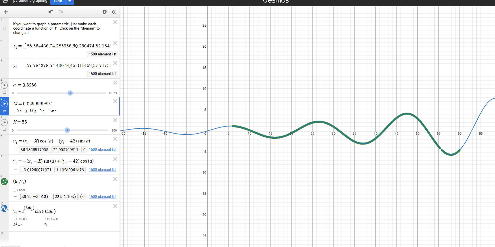

# Curve Fitting Assignment

## What the assignment is asking

Provides a CSV file, `xy_data.csv` containing x and y coordinates of a curve in a random order and we are asked to find the value of the unknowns

The unknowns are:
- `theta` = the rotation angle
- `M` = the growth/decay factor inside the wave term
- `X` = the horizontal shift

## The equations

The curve can be written as:

```text
x = t + cos(theta) - exp(M * t) * sin(0.3 * t) * sin(theta) + X

y = 42 + t + sin(theta) + exp(M * t) * sin(0.3 * t) * cos(theta)
```

The first is to undo the geometry first by subtracting the shift and unrotating the equations

After subtracting the shift and rotating backward:

```text
x - X = cos(theta) * u - sin(theta) * v

y - 42 = sin(theta) * u + cos(theta) * v
```

Here, `u` behaves like the forward motion of the curve and `v` behaves like the wave part:

```text
v = exp(M * u) * sin(0.3 * u)
```

## Method used in the notebook

1. Load the points from `xy_data.csv`.
2. Try values of `theta` and `X`.
3. Shift the data by `X` and `42`.
4. Rotate the points backward.
5. Estimate `M` from the transformed wave values.
6. Score the fit by checking how small the transformed residuals are.
7. Run a narrower validation search around the best result.

## Why this works

Reduce the main equations by undoing the rotation and shift to get a simple rotation curve.

Once the rotation and shift are removed, the curve becomes much easier to interpret. That turns the problem into a cleaner parameter search instead of a brute-force guess over everything at the same time.

## Result from the notebook

The notebook predicts:

- `theta = 30.00000000`
- `X = 55.00000000`
- `M = 0.0299999897`


## Desmos section

The Desmos graph is the visual check for the same method.

In the screenshot, I used:

- `a = 0.5236` radians, which is 30 degrees
- `X = 55`
- `M = 0.0299999897`



After shifting by `X` and `42`, then rotating the points backward by `a`, the transformed points line up with the wave model very closely. That is why the Desmos graph supports the same final answer as the notebook.

## Citation

- Wikipedia, "Rotation matrix": https://en.wikipedia.org/wiki/Rotation_matrix

## Files

- `assignment_solution.ipynb` = the main notebook with the fitting process
- `xy_data.csv` = the data points
